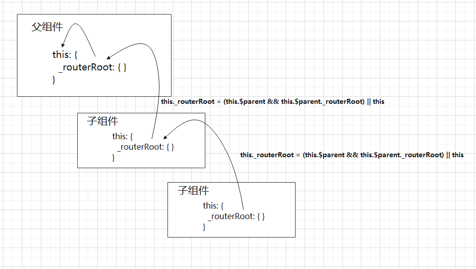

# Vue-Router 源码解析

## 介绍

Vue-Router 的能力十分强大，它支持 `hash`、`history`、`abstract` 3 种路由方式，提供了 `<router-link>` 和 `<router-view>` 2 种组件，还提供了简单的路由配置和一系列好用的 API。

```
<div id="app">
  <h1>Hello App!</h1>
  <p>
    <!-- 使用 router-link 组件来导航. -->
    <!-- 通过传入 `to` 属性指定链接. -->
    <!-- <router-link> 默认会被渲染成一个 `<a>` 标签 -->
    <router-link to="/foo">Go to Foo</router-link>
    <router-link to="/bar">Go to Bar</router-link>
  </p>
  <!-- 路由出口 -->
  <!-- 路由匹配到的组件将渲染在这里 -->
  <router-view></router-view>
</div>
```

```js
import Vue from 'vue';
import VueRouter from 'vue-router';
import App from './App';

Vue.use(VueRouter);

// 1. 定义（路由）组件。
// 可以从其他文件 import 进来
const Foo = { template: '<div>foo</div>' };
const Bar = { template: '<div>bar</div>' };

// 2. 定义路由
// 每个路由应该映射一个组件。 其中"component" 可以是
// 通过 Vue.extend() 创建的组件构造器，
// 或者，只是一个组件配置对象。
// 我们晚点再讨论嵌套路由。
const routes = [
  { path: '/foo', component: Foo },
  { path: '/bar', component: Bar },
];

// 3. 创建 router 实例，然后传 `routes` 配置
// 你还可以传别的配置参数, 不过先这么简单着吧。
const router = new VueRouter({
  routes, // （缩写）相当于 routes: routes
});

// 4. 创建和挂载根实例。
// 记得要通过 router 配置参数注入路由，
// 从而让整个应用都有路由功能
const app = new Vue({
  el: '#app',
  render(h) {
    return h(App);
  },
  router,
});
```

## Vue.use()

Vue 提供了 `Vue.use` 的全局 API 来注册这些插件，所以我们先来分析一下它的实现原理，定义在 `vue/src/core/global-api/use.js` 中：

```js
export function initUse(Vue: GlobalAPI) {
  Vue.use = function(plugin: Function | Object) {
    const installedPlugins =
      this._installedPlugins || (this._installedPlugins = []);
    if (installedPlugins.indexOf(plugin) > -1) {
      return this;
    }

    const args = toArray(arguments, 1);
    args.unshift(this);
    if (typeof plugin.install === 'function') {
      plugin.install.apply(plugin, args);
    } else if (typeof plugin === 'function') {
      plugin.apply(null, args);
    }
    installedPlugins.push(plugin);
    return this;
  };
}
```

`Vue.use` 接受一个 `plugin` 参数，并且维护了一个 `_installedPlugins` 数组，它存储所有注册过的 `plugin`；接着又会判断 `plugin` 有没有定义 `install` 方法，如果有的话则调用该方法，并且该方法执行的第一个参数是 `Vue`；最后把 `plugin` 存储到 `installedPlugins` 中。

## install 方法

父子组件生命周期执行顺序

```
父beforeCreate
父created
父beforeMount
子beforeCreate
子created
子beforeMount
子mounted
父mounted
```

由于 Vue 父子组件渲染会先执行父级组件的 `beforeCreate`，在执行子组件的 `beforeCreate`



```js
export let _Vue;
export function install(Vue) {
  if (install.installed && _Vue === Vue) return;
  install.installed = true;

  _Vue = Vue;

  const isDef = v => v !== undefined;

  const registerInstance = (vm, callVal) => {
    let i = vm.$options._parentVnode;
    if (
      isDef(i) &&
      isDef((i = i.data)) &&
      isDef((i = i.registerRouteInstance))
    ) {
      i(vm, callVal);
    }
  };

  Vue.mixin({
    beforeCreate() {
      if (isDef(this.$options.router)) {
        this._routerRoot = this;
        this._router = this.$options.router;
        this._router.init(this);
        Vue.util.defineReactive(this, '_route', this._router.history.current);
      } else {
        this._routerRoot = (this.$parent && this.$parent._routerRoot) || this;
      }
      registerInstance(this, this);
    },
    destroyed() {
      registerInstance(this);
    },
  });

  Object.defineProperty(Vue.prototype, '$router', {
    get() {
      return this._routerRoot._router;
    },
  });

  Object.defineProperty(Vue.prototype, '$route', {
    get() {
      return this._routerRoot._route;
    },
  });

  Vue.component('RouterView', View);
  Vue.component('RouterLink', Link);

  const strats = Vue.config.optionMergeStrategies;
  strats.beforeRouteEnter = strats.beforeRouteLeave = strats.beforeRouteUpdate =
    strats.created;
}
```

在 Vue-Router 的插件的 `install` 中使用了 `Vue.mixin()` 将每个组件的 `beforeCreate`, `destroyed` 生命周期混了一些逻辑。

由于 Vue 组件树中 Vue 实例 this 上添加了 `this._routerRoot`, 指向根组件，在后续组件中没有 `this.$options.router` ，然后都会 `this._routerRoot` 指向父级的 `_routerRoot` ，完成了一次实例赋值的递归。

同时使用了 `Object.defineProperty` 在 Vue 原型上定义了 `$router`,`$route`

接下来我们需要创建匹配函数，当页面 url 发生变化时，能够匹配到当前的 Component。

## 创建匹配器

- match: 匹配功能
- addRoutes: 添加动态路由

```js
function createMather(routes) {
  // pathList: ["/", "/about","/about/a","/about/b"]
  // pathMap: {"/", component: {}, "/about", component: {}, "/about/a", component: {}, "/about/b", component: {},}
  let { pathList, pathMap } = createRouteMap(routes);

  function match() {}

  function addRoutes(routes) {}

  return {
    match,
    addRoutes,
  };
}
```

## 创建历史管理

Vue-Router 提供两种路由模式：hashHistory, browserHistory

VueRouter 类定义了 init 方法，使用了 History 类的 `history.transitionTo` ，通过监听 url 辩护 `window.addEventListener("popstate" | "hashchange")` 进而确定当前 route 信息 `route = this.router.match(location, this.current)`

```js
class VueRouter {
    init (app: any /* Vue component instance */) {
      const setupListeners = routeOrError => {
        history.setupListeners()
        handleInitialScroll(routeOrError)
      }
      history.transitionTo(
        history.getCurrentLocation(),
        setupListeners,
        setupListeners
      )
    }

    history.listen(route => {
      this.apps.forEach(app => {
        app._route = route
      })
    })
  }
}
```

```js
export class History {

  transitionTo (
    location: RawLocation,
    onComplete?: Function,
    onAbort?: Function
  ) {
    let route
    // catch redirect option https://github.com/vuejs/vue-router/issues/3201
    try {
      route = this.router.match(location, this.current)
    } catch (e) {
      this.errorCbs.forEach(cb => {
        cb(e)
      })
      // Exception should still be thrown
      throw e
    }
    const prev = this.current
    )
  }
}
```

```js
class HashHistory extends History {
  setupListeners() {
    if (this.listeners.length > 0) {
      return;
    }

    const router = this.router;
    const expectScroll = router.options.scrollBehavior;
    const supportsScroll = supportsPushState && expectScroll;

    if (supportsScroll) {
      this.listeners.push(setupScroll());
    }

    const handleRoutingEvent = () => {
      const current = this.current;
      if (!ensureSlash()) {
        return;
      }
      this.transitionTo(getHash(), route => {
        if (supportsScroll) {
          handleScroll(this.router, route, current, true);
        }
        if (!supportsPushState) {
          replaceHash(route.fullPath);
        }
      });
    };
    const eventType = supportsPushState ? 'popstate' : 'hashchange';
    window.addEventListener(eventType, handleRoutingEvent);
    this.listeners.push(() => {
      window.removeEventListener(eventType, handleRoutingEvent);
    });
  }
}
```
